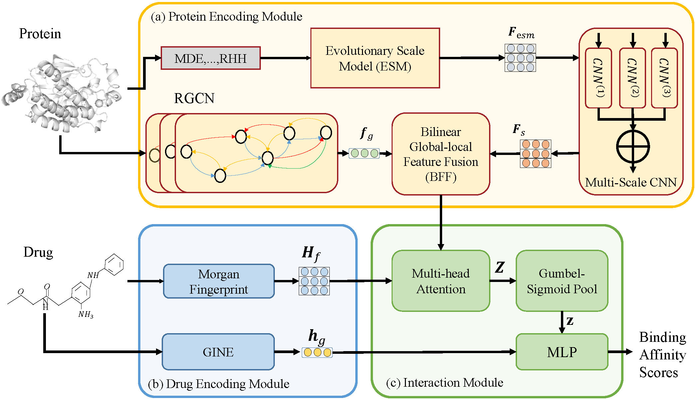

# Multi-modal Drug-Target Affinity Prediction via 3D Structural Features of Protein

## Abstract
**Background:** Despite significant progress in deep learning-based methods for predicting drug-target affinity (DTA), existing approaches primarily encode protein sequence information while neglecting critical three-dimensional (3D) structural features. To address this limitation, we propose the Multi-Modal Feature Fusion-based Drug-Target Affinity (MMFFDTA) prediction model, which leverages multi-modal feature fusion to integrate protein 3D structural information with amino acid sequence data. Specifically, the model employs a pre-trained relational graph neural network (RGNN) to encode protein 3D structures and fuses this information with sequence embeddings through a bilinear fusion module. In addition, the model utilizes an interaction module with cross-attention to capture complex correlations between drugs and proteins for drug-target affinity prediction. 

**Results:** Experimental results demonstrate that MMFFDTA outperforms state-of-the-art methods in predicting DTIs, achieving a root mean square error (RMSE) of $1.2689$ and a Pearson correlation coefficient (PCORR) of $0.7885$ on the PDBbind-KIKD dataset. Visualization analysis further reveals the model's ability to identify key binding residues and drug substructures, highlighting its potential in accelerating protein-binding site discovery and drug repurposing.

**Conclusion:** The MMFFDTA prediction model significantly improves the prediction performance of protein-ligand binding interactions by integrating amino acid sequence and 3D structural information of proteins.

## Overview

